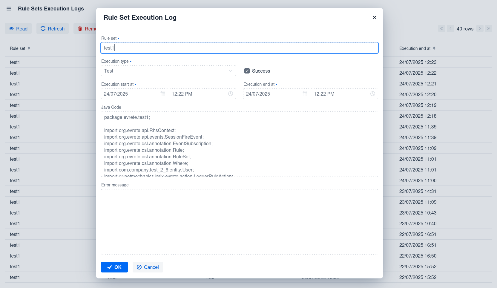

image::https://img.shields.io/badge/license-Apache%20License%202.0-blue.svg?style=flat[license,link=http://www.apache.org/licenses/LICENSE-2.0,window=_blank,opts=nofollow]

= Evrete add-on for Jmix

== What is Evrete?

Evrete is a standard-compliant, lightweight, open-source, and developer-friendly Java Rule Engine for goals of any size and complexity.

https://www.evrete.org[www.evrete.org, window=_blank]

== What does the add-on provide?

The Jmix Evrete add-on adds a user-friendly interface for RuleSet and Rule management based on Evrete's DSL (Annotated Java Rules). You can create, configure, and manage RuleSet and Rules with just a few clicks, directly within your Jmix application at runtime.

image:./docs/rulset1.png[width=412]
image:./docs/rulset2.png[width=412]
image:./docs/rulset3.png[width=412]
image:./docs/rulset4.png[width=412]

== Installation

The following table shows which version of the add-on is compatible with which version of the platform:

[options="autowidth,header"]
|===
|Jmix Version|Add-on Version|Implementation
|2.6.x|1.0.0|gr.netmechanics.jmix:jmix-evrete-starter:1.0.0
|===

For manual installation, add the following dependencies to your `build.gradle`:

[source,gradle]
----
implementation 'gr.netmechanics.jmix:jmix-evrete-starter:<addon-version>'
----

== Usage

=== UI

This UI provides a user-friendly interface for working with the Evrete rule engine, leveraging its *Annotated Java Rules API*.

WARNING: Add-on supports the following annotations `@RuleSet`, `@Rule` and `@Where` only.

==== Key Features

RuleSet and Rule Management::
Easily create, modify, and organize your RuleSets and the individual Rules within them through a user-friendly interface.

Condition and Action Definition::
Define precise property conditions for your rules and specify the actions to be executed when those conditions are met.
+
image::./docs/rulset1.png[]
image::./docs/rulset2.png[]

Code & Generator Data Preview::
Gain insight into the underlying logic by previewing the generated Evrete code for your RuleSets and the data used.
+
image::./docs/rulset3.png[]
image::./docs/rulset4.png[]

RuleSet Testing::
Users can test rule execution directly from the UI before saving the modified RuleSet.

Manual RuleSet Execution::
You can trigger RuleSet executions manually or schedule them automatically using the Quartz add-on (programmatically).

Execution Logs::
Access detailed execution logs to monitor and troubleshoot rule processing effectively.
+

== Configuration

There are three properties available to configure the behavior of the add-on.

[options="header,autowidth",cols=",^,a"]
|===
|Property|Default|Description
|jmix.evrete.entity-selection-mode|normal|Defines the selection mode for entities used in rule property conditions. Possible values `normal` or `annotated`.
|jmix.evrete.default-facts-provider-force-annotated-applicable|false|Allows `DefaultFactsProvider` to be applicable when `entitySelectionMode` is `annotated`.
|jmix.evrete.default-facts-provider-force-normal-inapplicable|false|Allows `DefaultFactsProvider` to be inapplicable when `entitySelectionMode` is `normal`.
|===
