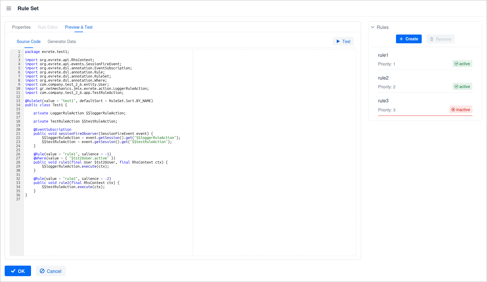

image::https://img.shields.io/badge/license-Apache%20License%202.0-blue.svg?style=flat[license,link=http://www.apache.org/licenses/LICENSE-2.0,window=_blank,opts=nofollow]

= Evrete add-on for Jmix

== What is Evrete?

 Evrete is a standard-compliant, lightweight, open-source, and developer-friendly Java Rule Engine for goals of any size and complexity.

https://www.evrete.org[www.evrete.org, window=_blank]

== What this add-on provides

The Jmix Evrete add-on adds a user-friendly interface for RuleSet and Rule management based on Evrete's DSL (Annotated Java Rules). You can create, configure, and manage RuleSet and Rules with just a few clicks, directly within your Jmix application at runtime.

image:./docs/rulset1.png[width=400]

